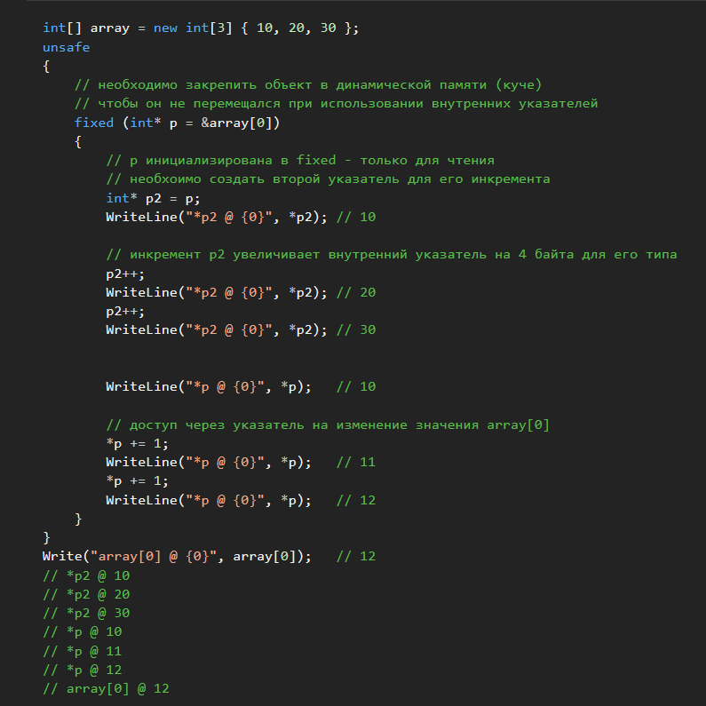

# Типы указателей
_________________________________________________________________________________________
В небезопасном контексте тип может быть типом указателя, типом значения или ссылочным
типом.
Объявления типа указателя выполняется одним из следующих способов:
```c#
type* identifier;
void* identifier; // допустимо, но не рекомендуется
```
В объявлении нескольких указателей знак ```*``` ставится у базового типа:
```c#
int* p1;
int* p2, p3;
// int *p2, *p3; // недопустимо
```

Тип, указанный до ```*``` в типе указателя, называется ссылочным типом. Ссылочным может быть
любой из указанных ниже типов:

* целочисленный тип: ```sbyte```, ```byte```, ```short```, ```ushort```, ```int```, ```uint```, ```long```, ```ulong```.

* тип с плавающей запятой: ```float```, ```double```.

* ```char```.

* ```bool```.

* ```decimal```.

* ```enum```.

* любой тип указателя (например выражения, такие как ```void**```).

* пользовательский тип структуры, содержащий поля неуправляемых типов.

#### Неявные и явные преобразования указателей: ####


#### Пример преобразования указателей: ####

```c#
int number = 1500;
// преобразование к указателю типа byte
byte* p = (byte*)&number;

Console.Write("4 байта целого числа:");
for (int i = 0; i < sizeof(int); i++)
    Console.Write(" {0:X2}", *p++);
// указатель указывает на младший адресный байт переменной,
// поэтому вывод 00 00 05 DC происходит в обратном порядке

Console.WriteLine("\nзначение целого числа: {0}", number);
// 4 байта целого числа: DC 05 00 00
// значение целого числа: 1500
```

Типы указателей не наследуются от объекта, упаковка- распаковка-преобразование не
поддерживают указатели.
#### Указатель не может указывать на ссылку или на структуру, содержащую ссылки, поскольку ####
#### ссылка на объект может быть подвергнута сбору мусора, даже если на неё указывает ####
#### указатель. ####

#### Объявления типов указателей: ####

* ```int* p```, где ```p``` – указатель на целое число.

* ```int** p```, где ```p``` – указатель на указатель на целое число.

* ```int*[] p```, где ```p``` – одномерный массив указателей на целые числа.

* ```char* p```, где ```p``` – указатель на тип char.

* ```void* p```, где ```p``` – указатель на неизвестный тип.

Оператор косвенного обращения указателя ```*``` можно использовать для доступа к содержимому,
на которое указывает переменная-указатель ```int* p```:
```c#
int i = 5;
int* p = &i;

// в 'p' содержится адрес на переменную типа int
Console.WriteLine(*p); // вывод хранящегося значения
```

#### Пример инкрементирования внутреннего указателя: ####



*для указателя типа ```void*``` использовать оператор косвенного обращения нельзя. Однако можно
использовать приведение для преобразования указателя типа ```void``` в любой другой тип и
наоборот.

Указатель может иметь значение ```null```.

Чтобы избежать неопределённости при передаче указателей между методами
рекомендуется использовать метод, возвращающий указатель в локальную переменную с помощью
параметра ```in```, ```out``` или ```ref``` либо в виде результата функции.

!!! Если указатель был задан в фиксированном блоке (fixed), переменная, на которую он
указывает, больше не может быть фиксированной.

#### Операторы, которые можно использовать с указателями: ####

* ```*``` – косвенное обращение к указателю или разыменование, позволяет выполнять чтение
указателя и запись в него.

* ```->``` – доступ к члену структуры через указатель, объединяет операции разыменования
указателя и доступа к члену.

* ```[]``` – индексирование указателя.

* ```&``` – получение адреса переменной.

* ```++``` и ```--``` – увеличение и уменьшение указателей.

* ```+``` и ```-``` – арифметические действия с указателем.

* ```==```, ```!=```, ```<```, ```>```, ```<=``` и ```>=``` – сравнение указателей.

* ```stackalloc``` – выделение памяти в стеке.

* оператор ```fixed``` – временная фиксация переменной, чтобы можно было найти её адрес.

#### Пример доступа к члену структуры через указатель: ####

```c#
class Program
{
    unsafe static void Main()
    {
        var pt = new Point();
        Point* pp = &pt;

        pp->x = 123; // OR (*pp).x = 123;
        pp->y = 456;

        System.Console.WriteLine("{0} {1}", pt.x, pt.y);
        // 123 456
    }
}

struct Point { public int x, y; }
```

#### Пример указателя на другой указатель: ####

```c#
int i = 50;

int* p1; // определение указателя 'p1'
p1 = &i; // указатель 'p1' указывает на адрес переменной 'i'

int** p2 = &p1;  // указатели 'p2' и 'p1' указывают на один адрес
**p2 = **p2 * 2; // изменение указателя 'p2' измененит значение 'i'

Console.WriteLine(i);    // 100
Console.WriteLine(**p2); // 100
```

#### Пример получения адреса памяти, на который указывает указатель: ####

```c#
int i = 100;

int* p = &i; // указатель 'p' указывает на адрес переменной 'i'

// получить адрес переменной 'i'
var addr = (ulong)p;
Console.WriteLine(addr); // 13627924
```

#### Пример операций с указателями: ####

```c#
int i = 100;

int* p1 = &i; // указатель 'p' указывает на адрес переменной 'i'

// получить адрес переменной 'i'
var addr = (ulong)p1;
Console.WriteLine("адрес переменной 'i': {0}", addr);

// так как 'p' – указатель на тип int, который занимает 4 байта
// можно получить указатель на следующий байт после 'addr'
byte* bytePointer = (byte*)(addr + 4); // указатель 'bytePointer' указывает на следующий байт
Console.WriteLine("значение byte по адресу {0}: {1}", addr + 4, *bytePointer);


// обратная операция
// получить адрес переменной 'i'
var oldAddr = (ulong)bytePointer - 4; // вычесть 4 байта, так как 'bytePointer' – указатель на следующий байт

int* p2 = (int*)oldAddr;
Console.WriteLine("значение int по адресу {0}: {1}", oldAddr, *p2);


// преобразование в тип double
// указатель 'doublePointer' указывает на следующие 8 байт, так как тип double занимает 8 байт
double* doublePointer = (double*)(addr + 4);
Console.WriteLine("значение double по адресу {0}: {1}", addr + 4, *doublePointer);
/*
адрес переменной 'i': 15986476
значение byte по адресу 15986480: 220
значение int по адресу 15986476: 100
значение double по адресу 15986480: 4,54209890715804E-304
*/
```

Операции вычитания и сложения над указателем выполняются в соответствии с правилами
арифметики указателей. Соответственно, если отнять от указателя ```doublePointer``` число 2,
адрес уменьшится не на 2, а на 16 (тип double 8 байт, 8 * 2 = 16):
```c#
double* doublePointer = (double*)15986480;
doublePointer = doublePointer - 2;
Console.WriteLine("адрес {0}", (ulong)doublePointer); // 15986464
```
